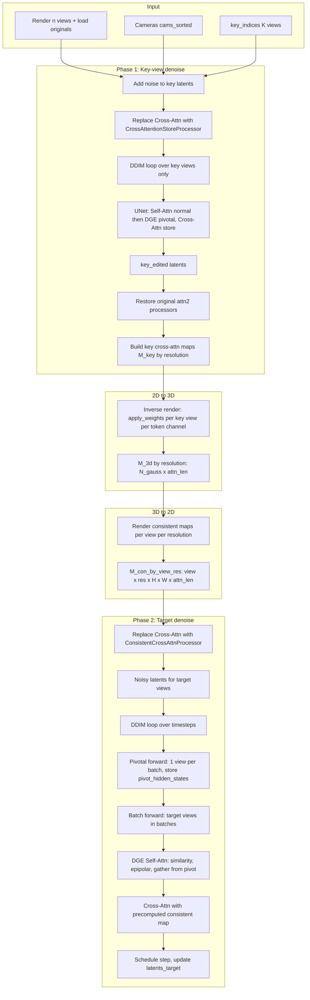

# Edit Multiview Pipeline: Technical Description for Paper

This document describes the **edit_multiview** pipeline in a form suitable for a paper: notation, equations, and the order of attention operations (self vs cross) in the UNet.

---

## 1. Overview

**Edit multiview** takes $ n $ camera views (rendered images and corresponding cameras), selects $ K $ **key views** ($ K \leq n $), and produces edited images for all views with **cross-view consistent** appearance. The pipeline has two main phases:

1. **Key-view denoising**: Denoise only the $ K $ key views with the UNet; during this pass, **cross-attention (image↔text)** is **stored** at multiple spatial resolutions.
2. **Target-view denoising**: For each diffusion step, run a **pivotal forward** (one view per batch as “pivot”), then **batch forward** over target views. In the UNet, **self-attention** uses DGE (cross-view feature injection from pivot/key), and **cross-attention** uses **consistent 2D maps** derived from key-view cross-attention inverse-rendered to 3D and re-rendered per view.

The following sections specify **where** (which block, which attention) **which operation** happens.

---

## 2. Notation

| Symbol | Meaning |
|--------|--------|
| $ n $ | Number of views |
| $ K $ | Number of key views; indices $ \mathcal{I}_{\text{key}} \subset \{0,\ldots,n-1\} $ |
| $ \mathcal{I}_{\text{targ}} $ | Target view indices (all $ n $ or $ n - K $ if key views are skipped in target loop) |
| $ B $ | Batch size in UNet (e.g. $ 3 \times \text{n\_frames} $ for CFG: pos/neg/neg) |
| $ L $ | Sequence length (spatial tokens), e.g. $ H \times W $ at a given resolution |
| $ D $ | Token dimension (channel) |
| $ \mathbf{x}_t^{(v)} $ | Latent of view $ v $ at timestep $ t $ |
| $ \mathbf{c}_{\text{img}}^{(v)}, \mathbf{c}_{\text{text}}^{(v)} $ | Image and text conditioning for view $ v $ |

---

## 3. Pipeline Diagram

---

## 4. Phase 1: Key-View Denoising

### 4.1 Setup

- **Key indices**: $ \mathcal{I}_{\text{key}} $ (e.g. uniform in $ [0, n-1] $, size $ K $).
- **Latents**: $ \mathbf{z}_t^{\text{key}} = \mathbf{z}_t[\mathcal{I}_{\text{key}}] \in \mathbb{R}^{K \times 4 \times H \times W} $.
- **Conditioning**: Concatenate (positive text, negative text, negative text) and (split image cond, split, zero) for key views only → batch size $ 3K $ for one UNet forward per step.
- **Cross-attention**: All `attn2` modules use **CrossAttentionStoreProcessor**, which runs standard cross-attention and **stores** attention weights (over valid text tokens) at each spatial resolution $ L \in \{ 32\times 32, 64\times 64 \} $ (or whatever the UNet uses).

### 4.2 UNet Forward (Key Views, Per Timestep)

For $ t_{\text{step}} \in \text{timesteps} $, one UNet forward with input batch size $ 3K $. Inside each **BasicTransformerBlock**:

1. **Self-attention (attn1)**  
   - For $ t_{\text{step}} \ge 100 $: **DGE mode** is enabled (`register_normal_attn_flag(False)`).  
   - **Pivotal pass**: `pivotal_pass = True` for this batch.  
   - Hidden state is reshaped to $ (3, K, L, D) $.  
   - **No cross-view indexing**: output is the normal self-attention over the $ 3K $ tokens (no gather from other batches).  
   - **kf_attn_output** is **not** written (the value stored here is never used, since each target step overwrites it in pivotal forward; saves memory and compute).  
   - For $ t_{\text{step}} < 100 $: standard self-attention (no DGE).

2. **Cross-attention (attn2)**  
   - **Standard cross-attention** (query = spatial, key/value = text):  
     $$
     \mathbf{Q} = \mathbf{W}_q \,\mathbf{H}, \quad \mathbf{K} = \mathbf{W}_k \,\mathbf{E}_{\text{text}}, \quad \mathbf{V} = \mathbf{W}_v \,\mathbf{E}_{\text{text}},
     $$
     $$
     \mathbf{A} = \mathrm{softmax}\left( \frac{\mathbf{Q}\mathbf{K}^\top}{\sqrt{d}} \right), \quad
     \mathbf{O}_{\text{cross}} = \mathbf{A} \mathbf{V}.
     $$
   - **Storage**: For valid content token indices $ \mathcal{T} $, the processor stores $ \mathbf{A}_{:,:,\mathcal{T}} $ at resolution $ L $ (spatial size $ L $) for later aggregation.

3. **Feed-forward**: Standard MLP after cross-attention.

After the loop, key latents are **key_edited**; stored maps are aggregated per resolution → **key cross-attention maps** $ M_{\text{key}}^{(r)} \in \mathbb{R}^{K \times L_r \times \lvert\mathcal{T}\rvert} $ for each resolution $ r $.

---

## 5. From Key Cross-Attention to Consistent Maps

### 5.1 Inverse Render (2D → 3D)

For each resolution $ r $ (e.g. $ L_r = 32\times 32 $ or $ 64\times 64 $):

- **Input**: $ M_{\text{key}}^{(r)} $, one 2D map per key view per token channel $ c \in \mathcal{T} $.
- **Output**: One 3D volume per channel, $ M_{3d}^{(r)} \in \mathbb{R}^{N_g \times \lvert\mathcal{T}\rvert} $, where $ N_g $ is the number of 3D Gaussians.

**Operation** (conceptually): For each key camera (at resolution $ r $), for each channel $ c $, treat the 2D map $ M_{\text{key},v}^{(r)}(h,w,c) $ as “image” and use **differentiable Gaussian splatting inverse** (e.g. `apply_weights`) to accumulate weights per Gaussian:

$$
M_{3d}^{(r)}(g, c) = \frac{ \sum_{v \in \mathcal{I}_{\text{key}}} w_{g,v,c} }{ \sum_{v} \#\{\text{contributions}\} + \epsilon },
$$

where $ w_{g,v,c} $ comes from the rasterizer’s weight contribution of Gaussian $ g $ to the 2D map at the corresponding pixel for view $ v $ and channel $ c $. (Implementation: loop over key views and channels, call `gaussian.apply_weights(cam, weights, weights_cnt, image_weights)` and normalize.)

### 5.2 Render Consistent Maps (3D → 2D, Per View)

For each **view** $ v \in \{0,\ldots,n-1\} $ and each resolution $ r $:

- **Input**: $ M_{3d}^{(r)} \in \mathbb{R}^{N_g \times \lvert\mathcal{T}\rvert} $.
- **Output**: $ M_{\text{con}}^{(v,r)} \in \mathbb{R}^{H_r \times W_r \times \lvert\mathcal{T}\rvert} $.

**Operation**: For each channel $ c $, use $ M_{3d}^{(r)}(\cdot, c) $ as per-Gaussian “color”; render view $ v $ at resolution $ r $ with the 3D Gaussian model to get a 2D image; stack over $ c $ → $ M_{\text{con}}^{(v,r)} $. Thus all views share the same 3D “cross-attention” field and get **view-consistent** 2D maps.

---

## 6. Phase 2: Target Denoising

### 6.1 Setup

- **Target indices** $ \mathcal{I}_{\text{targ}} $: either $ \{0,\ldots,n-1\} $ or $ \{0,\ldots,n-1\} \setminus \mathcal{I}_{\text{key}} $ (if key views are skipped in target loop).
- **Latents**: $ \mathbf{z}_t[\mathcal{I}_{\text{targ}}] $; if key views are skipped, $ \mathbf{z}_t[\mathcal{I}_{\text{key}}] $ is set to **key_edited** and not updated in this loop.
- **Cross-attention**: All `attn2` use **ConsistentCrossAttnProcessor**. When processing a batch, the processor receives a **precomputed consistent map** $ M_{\text{con}}^{(v,r)} $ (for the views in the batch and the current spatial resolution $ L = H_r W_r $) and uses it **instead of** recomputing attention from text:
  $$
  \mathbf{O}_{\text{cross}} = M_{\text{con}} \,\mathbf{V}_{:\lvert\mathcal{T}\rvert}.
  $$
  So cross-attention is **image-driven** (consistent map) and only the value vectors from the first $ \lvert\mathcal{T}\rvert $ text tokens are used.

### 6.2 Per-Timestep: Pivotal Forward Then Batch Forward

For each $ t_{\text{step}} $:

1. **Pivotal forward**  
   - One view per batch (the “pivot”) is chosen (e.g. random per batch index).  
   - UNet forward with batch size $ 3 \times \text{num\_batches} $.  
   - In each DGE block: **pivotal_pass = True**; hidden state is $ (3, \text{num\_batches}, L, D) $; **self-attention** is standard over this batch; output is stored as **pivot_hidden_states** and **kf_attn_output** for use in the next step.

2. **Batch forward (target views)**  
   - Batches of target views (e.g. `camera_batch_size` views at a time), each batch repeated for CFG → batch size $ 3 \times \text{batch\_size} $.  
   - For each batch, DGE blocks receive `batch_idx`, `cams`, `key_cams`, and (optionally) epipolar constraints.  
   - **pivotal_pass = False**. Below we detail the **self-attention** and **cross-attention** in the DGE block for this pass.

---

## 7. DGE Block in Target Phase (Batch Forward)

Each **BasicTransformerBlock** is replaced by **DGEBlock** when DGE is active. For a **non-pivotal** (target) batch, the following happens **in order** inside the block.

### 7.1 Input Layout

- **hidden_states**: $ (B, L, D) $ with $ B = 3 \times n_{\text{frames}} $.  
- Reshape to $ (3, n_{\text{frames}}, L, D) $.  
- **norm_hidden_states** = LayerNorm(hidden_states) (or AdaLN), same shape.

### 7.2 Camera Distance and “Closest” Pivot Frames

- **Camera distance**:  
  $$
  D_{\text{cam}}(i, j) = \| \mathbf{o}_i - \mathbf{o}_j \|_2,
  $$
  where $ \mathbf{o}_i $ is the camera center of view $ i $. Computed between current batch cameras and **key (pivot) cameras**.
- **Closest cameras**: For each frame in the batch, take the 1 or 2 closest pivot views (depending on `batch_idxs`), giving indices **closest_cam** and pivot hidden states **closest_cam_pivot_hidden_states** $ \in \mathbb{R}^{n_{\text{frames}} \times 1 \text{ or } 2 \times L \times D} $.

### 7.3 Spatio-Temporal Similarity (Self-Attention Prep)

- **Similarity** between current-frame tokens and closest-pivot tokens (cosine similarity via einsum):  
  $$
  \mathrm{sim} = \frac{ \langle \tilde{\mathbf{H}}^{(1)}, \tilde{\mathbf{H}}_{\text{pivot}} \rangle }{ \|\tilde{\mathbf{H}}^{(1)}\| \|\tilde{\mathbf{H}}_{\text{pivot}}\| },
  $$
  where $ \tilde{\mathbf{H}}^{(1)} $ is the **positive** branch of norm_hidden_states $ (1, n_{\text{frames}}, L, D) $, and $ \tilde{\mathbf{H}}_{\text{pivot}} $ is from closest_cam_pivot_hidden_states. Shape of `sim`: $ (n_{\text{frames}}, 1 \text{ or } 2, L, L) $.
- **argmax over last dimension**: For each spatial position $ p $ in the current view, get the index of the pivot token with highest similarity → **idx1** (and **idx2** if two pivots). Optionally **epipolar constraint**: mask out geometrically inconsistent positions (set sim to 0 and recompute argmax).

### 7.4 Self-Attention (attn1)

- **Pivotal pass**: Not used here (we are in target batch).
- **Non-pivotal**:  
  - **attn_output** is **not** computed by running self-attention on the current batch.  
  - Instead, **kf_attn_output** (cached from the pivotal forward) is used: it has shape $ (3, n_{\text{pivot}}, L, D) $.  
  - **Gather**: For each frame, take the pivot-frame self-attention output at the **idx1** (and **idx2**) positions; if two pivots, optionally **weighted blend** by inverse camera distance:  
    $$
    \mathbf{O}_{\text{self}} = w_1 \, \text{gather}(\text{kf\_attn}, \text{idx1}) + (1-w_1) \, \text{gather}(\text{kf\_attn}, \text{idx2}).
    $$
  So **self-attention** in the target pass is **cross-view feature injection** from the pivotal (key) views, guided by similarity (and optionally epipolar geometry).

### 7.5 Feature Injection and Residual

- **attn_output** (from gather or from pivotal cache) is added to the **input hidden_states** (residual):  
  $$
  \mathbf{H} \leftarrow \mathbf{H} + \mathbf{O}_{\text{self}}.
  $$

### 7.6 Cross-Attention (attn2)

- **ConsistentCrossAttnProcessor**:  
  $$
  \mathbf{V}_{\text{valid}} = \mathbf{V}_{:\lvert\mathcal{T}\rvert}, \qquad
  \mathbf{O}_{\text{cross}} = M_{\text{con}} \,\mathbf{V}_{\text{valid}},
  $$
  where $ M_{\text{con}} $ is the precomputed consistent map for this batch’s views and current resolution (shape $ (\text{batch}, L, \lvert\mathcal{T}\rvert) $). No query–key attention is computed; the map is fixed from the 3D inverse-render and re-render.

### 7.7 Feed-Forward

- Standard: $ \mathbf{H} \leftarrow \mathbf{H} + \mathrm{MLP}(\mathrm{LN}(\mathbf{H})) $.

---

## 8. Summary: Order of Attention Operations

| Phase | Block / stage | Attention type | Operation |
|-------|----------------|----------------|-----------|
| **Key denoise** | Every BasicTransformerBlock | **Self (attn1)** | Normal self-attention over $ 3K $ tokens; **kf_attn_output** is not stored (not used in target phase). |
| **Key denoise** | Every BasicTransformerBlock | **Cross (attn2)** | Standard $ \mathrm{Attn}(\mathbf{Q}_{\text{spatial}}, \mathbf{K}/\mathbf{V}_{\text{text}}) $; **store** $ \mathbf{A}_{:,:,\mathcal{T}} $ per resolution. |
| **Target denoise** | Pivotal forward | **Self (attn1)** | Normal self-attention; **store** pivot_hidden_states and kf_attn_output. |
| **Target denoise** | Pivotal forward | **Cross (attn2)** | Not used with consistent map in the same way; can be standard or N/A depending on setup. |
| **Target denoise** | Batch forward, DGE block | **Self (attn1)** | **No** direct self-attention on current batch; **gather** from kf_attn_output using idx1/idx2 (similarity + optional epipolar). |
| **Target denoise** | Batch forward, DGE block | **Cross (attn2)** | **Consistent**: $ \mathbf{O} = M_{\text{con}} \mathbf{V}_{\text{valid}} $, no Q–K attention. |

---

## 9. Equations at a Glance

**Key-view cross-attention (stored):**
$$
\mathbf{A} = \mathrm{softmax}\left( \frac{\mathbf{Q}\mathbf{K}^\top}{\sqrt{d}} \right), \quad \mathbf{Q} = \mathbf{W}_q \mathbf{H}_{\text{spatial}}, \quad \mathbf{K},\mathbf{V} = \mathbf{W}_{k,v} \mathbf{E}_{\text{text}}.
$$

**Inverse render (2D → 3D):**
$$
M_{3d}(g, c) \propto \sum_{v \in \mathcal{I}_{\text{key}}} \text{weight}_v(g \to \text{pixel}(M_{\text{key},v}^{(c)})).
$$

**Consistent cross-attention (target views):**
$$
\mathbf{O}_{\text{cross}} = M_{\text{con}}^{(v,r)} \, \mathbf{V}_{:\lvert\mathcal{T}\rvert}.
$$

**Self-attention in target (DGE gather):**
$$
\mathbf{O}_{\text{self}} = \text{gather}\bigl( \text{kf\_attn\_output}, \; \arg\max_{\text{pivot}} \mathrm{sim}(\mathbf{H}_{\text{cur}}, \mathbf{H}_{\text{pivot}}) \bigr).
$$

Optional epipolar masking: set $ \mathrm{sim}(p, \cdot) = 0 $ for pixel $ p $ that do not satisfy epipolar geometry with the chosen pivot, then recompute argmax.

---

*Reference: `threestudio/systems/DGE.py` (edit_multiview), `threestudio/models/guidance/dge_guidance.py` (edit_latents_multiview, CrossAttentionStoreProcessor, ConsistentCrossAttnProcessor), `threestudio/utils/dge_utils.py` (DGEBlock, make_dge_block).*
