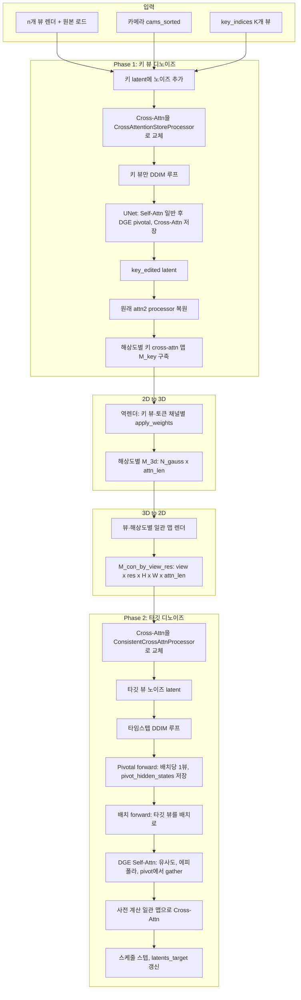

# Edit Multiview 파이프라인: 논문용 기술 설명 (한국어)

> **수식 미리보기**: 이 문서는 `$...$`(인라인), `$$...$$`(블록) LaTeX 수식을 사용합니다. VS Code 기본 미리보기는 수식을 지원하지 않습니다. **Markdown All in One**, **Markdown+Math** 확장을 설치하거나, GitHub에서 열면 수식이 렌더됩니다.

본 문서는 **edit_multiview** 파이프라인을 논문에 넣기 쉬운 형태로 정리합니다. 기호, 수식, UNet 내에서의 attention( self / cross ) 연산 순서를 구체적으로 기술합니다.

---

## 1. 개요

**Edit multiview**는 $n$개의 카메라 뷰(렌더 이미지 및 카메라)를 입력으로 받아, 그중 $K$개의 **키 뷰**($K \leq n$)를 선택하고, **뷰 간 일관된** 편집 결과를 모든 뷰에 대해 만듭니다. 파이프라인은 두 단계로 구성됩니다.

1. **키 뷰 디노이징**: $K$개의 키 뷰만 UNet으로 디노이징하며, 이때 **cross-attention(이미지↔텍스트)** 을 여러 공간 해상도에서 **저장**합니다.
2. **타깃 뷰 디노이징**: 각 디퓨전 스텝마다 **pivotal forward**(배치당 한 뷰를 pivot으로)를 먼저 수행한 뒤, 타깃 뷰들에 대해 **배치 forward**를 수행합니다. UNet 내부에서는 **self-attention**은 DGE( pivot/key 뷰로부터의 cross-view feature 주입)를 사용하고, **cross-attention**은 키 뷰 cross-attention을 3D로 역렌더한 뒤 뷰별로 다시 렌더해 얻은 **일관 2D 맵**을 사용합니다.

아래 절에서는 **어느 블록·어떤 attention**에서 **어떤 연산**이 일어나는지 구체적으로 적습니다.

---

## 2. 기호 정의

| 기호 | 의미 |
|------|------|
| $n$ | 뷰 개수 |
| $K$ | 키 뷰 개수; 인덱스 $\mathcal{I}_{\text{key}} \subset \{0,\ldots,n-1\}$ |
| $\mathcal{I}_{\text{targ}}$ | 타깃 뷰 인덱스 (전체 $n$개 또는 target loop에서 키 뷰를 건너뛸 경우 $n - K$개) |
| $B$ | UNet 배치 크기 (예: CFG pos/neg/neg에 대해 $3 \times \text{n\_frames}$) |
| $L$ | 시퀀스 길이(공간 토큰), 해당 해상도에서 $H \times W$ |
| $D$ | 토큰 차원(채널) |
| $\mathbf{x}_t^{(v)}$ | timestep $t$, 뷰 $v$의 latent |
| $\mathbf{c}_{\text{img}}^{(v)}, \mathbf{c}_{\text{text}}^{(v)}$ | 뷰 $v$에 대한 이미지·텍스트 조건 |

---

## 3. 파이프라인 도식

---

## 4. Phase 1: 키 뷰 디노이징

### 4.1 설정

- **키 인덱스**: $\mathcal{I}_{\text{key}}$(예: $[0, n-1]$ 균등, 크기 $K$).
- **Latent**: $\mathbf{z}_t^{\text{key}} = \mathbf{z}_t[\mathcal{I}_{\text{key}}] \in \mathbb{R}^{K \times 4 \times H \times W}$.
- **조건**: 키 뷰만 (positive text, negative text, negative text) 및 (split image cond, split, zero)를 이어 붙여 스텝당 한 번의 UNet forward에서 배치 크기 $3K$.
- **Cross-attention**: 모든 `attn2`에 **CrossAttentionStoreProcessor**를 사용하며, 표준 cross-attention을 수행한 뒤 유효 텍스트 토큰에 대한 attention 가중치를 각 공간 해상도 $L \in \{ 32\times 32, 64\times 64 \}$(또는 UNet이 사용하는 해상도)마다 **저장**합니다.

### 4.2 UNet Forward (키 뷰, 타임스텝별)

$t_{\text{step}} \in \text{timesteps}$마다 배치 크기 $3K$로 UNet forward 한 번. 각 **BasicTransformerBlock** 내부에서는 다음 순서로 진행됩니다.

1. **Self-attention (attn1)**  
   - $t_{\text{step}} \ge 100$일 때: **DGE 모드** 활성화(`register_normal_attn_flag(False)`).  
   - **Pivotal pass**: 이 배치에 대해 `pivotal_pass = True`.  
   - Hidden state를 $(3, K, L, D)$로 reshape.  
   - **Cross-view 인덱싱 없음**: $3K$ 토큰에 대한 일반 self-attention 출력만 사용(다른 배치에서 gather 하지 않음).  
   - **kf_attn_output**에는 저장하지 않음(타깃 단계에서는 매 스텝 pivotal forward가 이 캐시를 덮어쓰므로 키 디노이즈 시 저장값은 사용되지 않음; 메모리·연산 절약).  
   - $t_{\text{step}} < 100$일 때: DGE 없이 일반 self-attention.

2. **Cross-attention (attn2)**  
   - **표준 cross-attention**(query = 공간, key/value = 텍스트):  
    $$
     \mathbf{Q} = \mathbf{W}_q \,\mathbf{H}, \quad \mathbf{K} = \mathbf{W}_k \,\mathbf{E}_{\text{text}}, \quad \mathbf{V} = \mathbf{W}_v \,\mathbf{E}_{\text{text}},
    $$
    $$
     \mathbf{A} = \mathrm{softmax}\left( \frac{\mathbf{Q}\mathbf{K}^\top}{\sqrt{d}} \right), \quad
     \mathbf{O}_{\text{cross}} = \mathbf{A} \mathbf{V}.
    $$
   - **저장**: 유효 콘텐츠 토큰 인덱스 $\mathcal{T}$에 대해, processor가 해상도 $L$(공간 크기 $L$)마다 $\mathbf{A}_{:,:,\mathcal{T}}$를 저장해 이후 집계에 사용.

3. **Feed-forward**: cross-attention 이후 표준 MLP.

루프 종료 후 키 latent는 **key_edited**로 고정되고, 저장된 맵을 해상도별로 집계해 **키 cross-attention 맵** $M_{\text{key}}^{(r)} \in \mathbb{R}^{K \times L_r \times \lvert\mathcal{T}\rvert}$를 각 해상도 $r$에 대해 얻습니다.

---

## 5. 키 Cross-Attention에서 일관 맵까지

### 5.1 역렌더 (2D → 3D)

각 해상도 $r$(예: $L_r = 32\times 32$ 또는 $64\times 64$)에 대해:

- **입력**: $M_{\text{key}}^{(r)}$, 키 뷰·토큰 채널 $c \in \mathcal{T}$당 2D 맵 하나.
- **출력**: 채널당 3D 볼륨 하나, $M_{3d}^{(r)} \in \mathbb{R}^{N_g \times \lvert\mathcal{T}\rvert}$. $N_g$는 3D 가우시안 개수.

**연산**(개념): 각 키 카메라(해상도 $r$)·채널 $c$에 대해 2D 맵 $M_{\text{key},v}^{(r)}(h,w,c)$를 “이미지”로 두고, **미분 가능 가우시안 스플래팅 역연산**(예: `apply_weights`)으로 가우시안별 가중치를 누적:

$$
M_{3d}^{(r)}(g, c) = \frac{ \sum_{v \in \mathcal{I}_{\text{key}}} w_{g,v,c} }{ \sum_{v} \#\{\text{기여}\} + \epsilon },
$$

$w_{g,v,c}$는 뷰 $v$, 채널 $c$에 대응하는 픽셀에 가우시안 $g$가 기여한 래스터라이저 가중치. (구현: 키 뷰·채널 루프, `gaussian.apply_weights(cam, weights, weights_cnt, image_weights)` 호출 후 정규화.)

### 5.2 일관 맵 렌더 (3D → 2D, 뷰별)

각 **뷰** $v \in \{0,\ldots,n-1\}$와 해상도 $r$에 대해:

- **입력**: $M_{3d}^{(r)} \in \mathbb{R}^{N_g \times \lvert\mathcal{T}\rvert}$.
- **출력**: $M_{\text{con}}^{(v,r)} \in \mathbb{R}^{H_r \times W_r \times \lvert\mathcal{T}\rvert}$.

**연산**: 채널 $c$마다 $M_{3d}^{(r)}(\cdot, c)$를 가우시안별 “색상”으로 사용해, 3D 가우시안 모델로 뷰 $v$를 해상도 $r$에서 렌더한 2D 이미지를 얻고, $c$에 대해 쌓아 $M_{\text{con}}^{(v,r)}$를 만듭니다. 따라서 모든 뷰가 동일한 3D “cross-attention” 필드를 공유하고 **뷰 일관** 2D 맵을 갖습니다.

---

## 6. Phase 2: 타깃 뷰 디노이징

### 6.1 설정

- **타깃 인덱스** $\mathcal{I}_{\text{targ}}$: 전체 $\{0,\ldots,n-1\}$이거나, target loop에서 키 뷰를 건너뛸 경우 $\{0,\ldots,n-1\} \setminus \mathcal{I}_{\text{key}}$.
- **Latent**: $\mathbf{z}_t[\mathcal{I}_{\text{targ}}]$; 키 뷰를 건너뛸 경우 $\mathbf{z}_t[\mathcal{I}_{\text{key}} ]$는 **key_edited**로 고정하고 이 루프에서는 갱신하지 않음.
- **Cross-attention**: 모든 `attn2`에 **ConsistentCrossAttnProcessor** 사용. 배치 처리 시 processor는 해당 배치의 뷰와 현재 공간 해상도 $L = H_r W_r$에 대한 **사전 계산 일관 맵** $M_{\text{con}}^{(v,r)}$을 받아, 텍스트로부터 attention을 다시 계산하는 대신 **이 맵을 사용**:
 $$
  \mathbf{O}_{\text{cross}} = M_{\text{con}} \,\mathbf{V}_{:\lvert\mathcal{T}\rvert}.
 $$
  즉 cross-attention은 **이미지 기반**(일관 맵)이며, 앞쪽 $\lvert\mathcal{T}\rvert$개 텍스트 토큰의 value만 사용합니다.

### 6.2 타임스텝별: Pivotal Forward 후 Batch Forward

각 $t_{\text{step}}$에 대해:

1. **Pivotal forward**  
   - 배치당 한 뷰(“pivot”)를 선택(예: 배치 인덱스별 랜덤).  
   - 배치 크기 $3 \times \text{num\_batches}$로 UNet forward.
   - 각 DGE 블록에서 **pivotal_pass = True**; hidden state는 $(3, \text{num\_batches}, L, D)$; **self-attention**은 이 배치에 대해 표준 연산; 출력을 **pivot_hidden_states**와 **kf_attn_output**에 저장해 다음 단계에서 사용.

2. **Batch forward (타깃 뷰)**  
   - 타깃 뷰를 배치 단위(예: `camera_batch_size`개씩)로 넣고, CFG를 위해 각 배치를 3번 반복 → 배치 크기 $3 \times \text{batch\_size}$.  
   - 각 배치에 대해 DGE 블록에 `batch_idx`, `cams`, `key_cams`, (선택) epipolar 제약 전달.  
   - **pivotal_pass = False**. 아래에서 이 패스의 DGE 블록 내 **self-attention**과 **cross-attention**을 자세히 기술합니다.

---

## 7. 타깃 단계의 DGE 블록 (Batch Forward)

DGE가 켜져 있을 때 각 **BasicTransformerBlock**은 **DGEBlock**으로 대체됩니다. **non-pivotal**(타깃) 배치에 대해 블록 내부에서 **순서대로** 다음이 수행됩니다.

### 7.1 입력 레이아웃

- **hidden_states**: $(B, L, D)$, $B = 3 \times n_{\text{frames}}$.
- $(3, n_{\text{frames}}, L, D)$로 reshape.
- **norm_hidden_states** = LayerNorm(hidden_states)(또는 AdaLN), 동일 shape.

### 7.2 카메라 거리와 “가장 가까운” Pivot 뷰

- **카메라 거리**:  
 $$
  D_{\text{cam}}(i, j) = \| \mathbf{o}_i - \mathbf{o}_j \|_2,
 $$
 $\mathbf{o}_i$는 뷰 $i$의 카메라 중심. 현재 배치 카메라와 **키(pivot) 카메라** 사이로 계산.
- **가장 가까운 카메라**: 배치의 각 프레임에 대해 pivot 뷰 중 거리 기준 1개 또는 2개 선택(`batch_idxs`에 따라), 인덱스 **closest_cam**과 pivot hidden state **closest_cam_pivot_hidden_states** $\in \mathbb{R}^{n_{\text{frames}} \times 1 \text{ or } 2 \times L \times D}$를 얻음.

### 7.3 시공간 유사도 (Self-Attention 준비)

- 현재 프레임 토큰과 가장 가까운 pivot 토큰 간 **유사도**(einsum으로 코사인 유사도):  
 $$
  \mathrm{sim} = \frac{ \langle \tilde{\mathbf{H}}^{(1)}, \tilde{\mathbf{H}}_{\text{pivot}} \rangle }{ \|\tilde{\mathbf{H}}^{(1)}\| \|\tilde{\mathbf{H}}_{\text{pivot}}\| },
 $$
 $\tilde{\mathbf{H}}^{(1)}$는 norm_hidden_states의 **positive** 브랜치 $(1, n_{\text{frames}}, L, D)$, $\tilde{\mathbf{H}}_{\text{pivot}}$는 closest_cam_pivot_hidden_states. `sim` shape: $(n_{\text{frames}}, 1 \text{ or } 2, L, L)$.
- **마지막 차원 argmax**: 현재 뷰의 각 공간 위치 $p$에 대해 유사도가 최대인 pivot 토큰 인덱스 → **idx1**(및 pivot 2개일 때 **idx2**). 선택적으로 **에피폴라 제약**: 기하적으로 일치하지 않는 위치를 마스크(sim을 0으로 두고 argmax 재계산).

### 7.4 Self-Attention (attn1)

- **Pivotal pass**: 여기서는 사용하지 않음(타깃 배치).
- **Non-pivotal**:  
  - **attn_output**은 현재 배치에 대한 self-attention을 수행해 구하지 **않음**.  
  - 대신 pivotal forward에서 캐시한 **kf_attn_output** 사용: shape $(3, n_{\text{pivot}}, L, D)$.  
  - **Gather**: 각 프레임에 대해 **idx1**(및 **idx2**) 위치의 pivot 프레임 self-attention 출력을 가져옴; pivot이 두 개면 역카메라 거리로 **가중 혼합** 가능:  
   $$
    \mathbf{O}_{\text{self}} = w_1 \, \text{gather}(\text{kf\_attn}, \text{idx1}) + (1-w_1) \, \text{gather}(\text{kf\_attn}, \text{idx2}).
   $$
  따라서 타깃 패스에서 **self-attention**은 pivot(키) 뷰로부터의 **cross-view feature 주입**이며, 유사도(및 선택적 에피폴라 기하)로 제어됩니다.

### 7.5 Feature 주입 및 잔차

- **attn_output**(gather 또는 pivotal 캐시)을 **입력 hidden_states**에 더함(잔차):  
 $$
  \mathbf{H} \leftarrow \mathbf{H} + \mathbf{O}_{\text{self}}.
 $$

### 7.6 Cross-Attention (attn2)

- **ConsistentCrossAttnProcessor**:  
 $$
  \mathbf{V}_{\text{valid}} = \mathbf{V}_{:\lvert\mathcal{T}\rvert}, \qquad
  \mathbf{O}_{\text{cross}} = M_{\text{con}} \,\mathbf{V}_{\text{valid}},
 $$
 $M_{\text{con}}$은 이 배치의 뷰와 현재 해상도에 대한 사전 계산 일관 맵(shape $(\text{batch}, L, \lvert\mathcal{T}\rvert)$). Query–key attention은 계산하지 않고, 3D 역렌더·재렌더로 얻은 고정 맵을 사용합니다.

### 7.7 Feed-Forward

- 표준: $\mathbf{H} \leftarrow \mathbf{H} + \mathrm{MLP}(\mathrm{LN}(\mathbf{H}))$.

---

## 8. 요약: Attention 연산 순서

| 단계 | 블록/구간 | Attention 종류 | 연산 |
|------|-----------|----------------|------|
| **키 디노이즈** | 각 BasicTransformerBlock | **Self (attn1)** | $3K$ 토큰에 대한 일반 self-attention; **kf_attn_output**에는 저장하지 않음(타깃 단계에서 사용하지 않음). |
| **키 디노이즈** | 각 BasicTransformerBlock | **Cross (attn2)** | 표준 $\mathrm{Attn}(\mathbf{Q}_{\text{spatial}}, \mathbf{K}/\mathbf{V}_{\text{text}})$; 해상도마다 $\mathbf{A}_{:,:,\mathcal{T}}$ **저장**. |
| **타깃 디노이즈** | Pivotal forward | **Self (attn1)** | 일반 self-attention; **pivot_hidden_states**와 **kf_attn_output** 저장. |
| **타깃 디노이즈** | Pivotal forward | **Cross (attn2)** | 동일 설정에서 일관 맵 사용 방식과는 별개; 설정에 따라 표준 또는 N/A. |
| **타깃 디노이즈** | Batch forward, DGE 블록 | **Self (attn1)** | 현재 배치에 대한 직접 self-attention **없음**; idx1/idx2(유사도 + 선택적 에피폴라)로 **kf_attn_output**에서 **gather**. |
| **타깃 디노이즈** | Batch forward, DGE 블록 | **Cross (attn2)** | **일관 맵**: $\mathbf{O} = M_{\text{con}} \mathbf{V}_{\text{valid}}$, Q–K attention 없음. |

---

## 9. 수식 요약

**키 뷰 cross-attention (저장):**
$$
\mathbf{A} = \mathrm{softmax}\left( \frac{\mathbf{Q}\mathbf{K}^\top}{\sqrt{d}} \right), \quad \mathbf{Q} = \mathbf{W}_q \mathbf{H}_{\text{spatial}}, \quad \mathbf{K},\mathbf{V} = \mathbf{W}_{k,v} \mathbf{E}_{\text{text}}.
$$

**역렌더 (2D → 3D):**
$$
M_{3d}(g, c) \propto \sum_{v \in \mathcal{I}_{\text{key}}} \text{weight}_v(g \to \text{pixel}(M_{\text{key},v}^{(c)})).
$$

**일관 cross-attention (타깃 뷰):**
$$
\mathbf{O}_{\text{cross}} = M_{\text{con}}^{(v,r)} \, \mathbf{V}_{:\lvert\mathcal{T}\rvert}.
$$

**타깃에서 self-attention (DGE gather):**
$$
\mathbf{O}_{\text{self}} = \text{gather}\bigl( \text{kf\_attn\_output}, \; \arg\max_{\text{pivot}} \mathrm{sim}(\mathbf{H}_{\text{cur}}, \mathbf{H}_{\text{pivot}}) \bigr).
$$

에피폴라 마스킹(선택): 선택한 pivot과 에피폴라 기하를 만족하지 않는 픽셀 $p$에 대해 $\mathrm{sim}(p, \cdot) = 0$으로 두고 argmax를 다시 계산.

---

*참고: `threestudio/systems/DGE.py` (edit_multiview), `threestudio/models/guidance/dge_guidance.py` (edit_latents_multiview, CrossAttentionStoreProcessor, ConsistentCrossAttnProcessor), `threestudio/utils/dge_utils.py` (DGEBlock, make_dge_block).*
